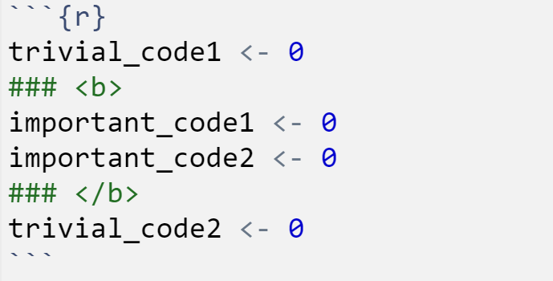
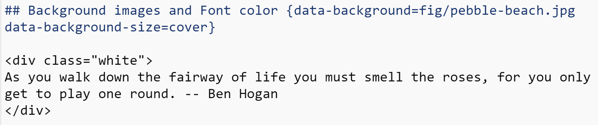
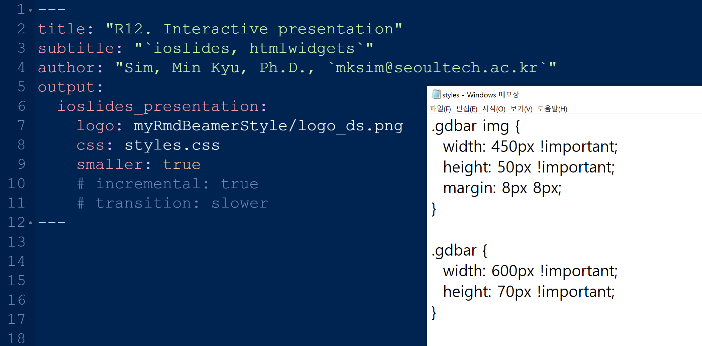

```{r setup, include=FALSE}
library(knitr)
knitr::opts_chunk$set(echo = TRUE)
knitr::opts_chunk$set(warning = FALSE)
knitr::opts_chunk$set(fig.align='center')
```

## Contents
+ Part I. `Bad Visualization`
+ Part II. `Why Is It Bad?`
+ Part III. `Good Alternatives`

# Part I. `Bad Visualization`

## 

<div style="text-align: center;">
  <iframe src="http://127.0.0.1:3388/" width="800" height="500" style="border: none;"></iframe>
</div>

### File type and format 

+ html
    + `ioslides`, `slidy`
    + `htmlwidget` 사용 가능, web에 간편하게 게시가능
+ pdf
    + `beamer`
    + 가장 formal하고 academic함
+ pptx - powerpoint

### Structure

| Header         | `rmarkdown` | in slides |
|:--------------:|:-----------:|:---------:|
| Level-1 header | `#`         | part      |
| Level-2 header | `##`        | page      |
| Level-3 header | `###`       | paragraph |

## `ioslides`

<iframe src="https://beyzakebeli.github.io/ioslides-map/" width="100%" height="500px" style="border:none;"></iframe>

+ R Markdown의 `html` 슬라이드 포맷
    + `htmlwidget` 사용 가능
    + web에 간편하게 게시가능
    + `css`파일을 사용하여 외형을 customization할 수 있음
+ `slidy` 
    + 상대적으로 customization의 영역이 더 많음
    + `ioslides` 보다 heavy함
+ https://bookdown.org/yihui/rmarkdown/ioslides-presentation.html

## Subtitling & Incremental Mode | This is my subtitle {.build}

+ 이 페이지의 Level-2 헤더는 아래와 같이 적었음 

````r
## Subtitling and Incremental Mode | This is my subtitle {.build}
````

+ Subtitle
    + 페이지의 title과 subtitle을 함께 넣을 수 있음

+ Incremental Mode 
    + `{.build}`를 적어주면 incremental mode가 실행됨
    + global하게 적용하려면 YAML 헤더에 `incremental: true`

## Presentation control | Chrome에서 파일을 열었을 때에 아래 키로 프리젠테이션 조작 가능 

+ 'f': enable fullscreen mode
+ 'w': toggle widescreen mode
+ 'o': enable overview mode
+ 'h': enable code highlight mode
+ 'p': show presenter notes

## Code highlighting {.build}

+ 'h': enable code highlight mode

```{r}
trivial_code1 <- 0
### <b>
important_code1 <- 0
important_code2 <- 0
### </b>
trivial_code2 <- 0
```

+ 위의 코드 블럭은 아래와 같이 입력했음 
+ Highlight하고 싶은 영역을 "`### <b>`"와 "`### </b>`"로 둘러쌓으면 됨 

```{r, fig.cap="Code highlight", echo=FALSE, out.height='20%', fig.align='center'}

```

## Background images and Font color {data-background=fig/pebble-beach.jpg data-background-size=cover}

<div class="white">
As you walk down the fairway of life you must smell the roses, for you only get to play one round. -- Ben Hogan
</div>

##

+ 앞 페이지의 Rmd 코드는 아래와 같음
    + Background images는 Level-2 Header에서 지정 (이미지 파일 경로와 사이즈 지정)
    + 폰트의 색을 바꾸고 싶은 영역을 `<div class="white">`와 `</div>`로 둘러싸면 하얀색 폰트로 나옴 

```{r, fig.cap="Background and font", echo=FALSE, out.height='30%', fig.align='center'}

```

## YAML Header of this lecture note {.build}

```{r, fig.cap="YAML header", echo=FALSE, fig.height=3, fig.width=7, fig.align='center'}

```

+ `logo` - 로고 파일 경로
+ `styles.css` - 스타일 파일을 이용해서 로고 이미지와 테두리 크기 지정 
+ `smaller` - 작은 폰트
+ `incremental` - incremental mode
+ `transition: slower` - 페이드 효과 

# Part II. `htmlwidget`

## `htmlwidget`

+ JavaScript 데이터 시각화물을 R에서 사용
+ Rmarkdown의 html 포맷과 shiny application에 widget 형태로 삽입
+ Interactive presentation

## 1. `plotly` 객체 | Interactive ggplot

```{r, message=FALSE, fig.width = 10, fig.height = 5}
library(ggplot2)
library(plotly)
fig <- ggplot(mpg, aes(x = displ, y = hwy)) + 
  geom_point(aes(color = class)) + geom_smooth()
### <b>
fig_plotly <- ggplotly(fig) 
### </b>
class(fig_plotly)
```

+ https://plotly.com/ggplot2/

## 

```{r}
fig_plotly
```

## 2. `dygraphs` 객체 | Interactive timeseries plot

```{r, message=FALSE, fig.width = 7, fig.height = 3}
library(dygraphs)
lungDeaths <- cbind(mdeaths, fdeaths)
fig_dygraph <- dygraph(lungDeaths) %>%
  dySeries("mdeaths", label = "Male") %>%
  dySeries("fdeaths", label = "Female") %>%
  dyOptions(stackedGraph = TRUE) %>%
  dyRangeSelector(height = 20)
class(fig_dygraph)
```

+ https://rstudio.github.io/dygraphs/

##

```{r, fig.cap="Deaths from Lung Disease (UK)"}
fig_dygraph
```

## 3. `leaflet()` | Interactive map

```{r}
library(leaflet)
fig_leaflet <- leaflet() %>% addTiles() %>% 
  setView(127.076, 37.631, zoom = 16) %>%
  addMarkers(127.076, 37.63148, label="Frontier bldg",
             labelOptions = labelOptions(noHide = TRUE, textsize = "15px"))
class(fig_leaflet)
```

+ https://rstudio.github.io/leaflet/

##

```{r}
fig_leaflet
```

<!-- ## `kable` 객체  -->

<!-- ```{r} -->
<!-- library(knitr) -->
<!-- library(kableExtra) -->
<!-- tbl_kable <- mpg[1:30,1:7] %>%  -->
<!--   kable() %>% -->
<!--   kable_styling( -->
<!--     bootstrap_options = c("striped", "hover", "condensed", "responsive"),  -->
<!--     font_size = 12, full_width = F) %>%  -->
<!--   column_spec(2, width = "10em", background = "yellow",  -->
<!--               bold = TRUE, border_right = TRUE) -->
<!-- class(tbl_kable) -->
<!-- ``` -->

<!-- + https://cran.r-project.org/web/packages/kableExtra/vignettes/awesome_table_in_html.html -->

<!-- ## -->

<!-- ```{r} -->
<!-- tbl_kable -->
<!-- ``` -->

## 4. `DT` (DataTables) 객체 | Interactive table

### Zero configuration

```{r}
library(DT)
tbl_DT1 <- datatable(iris)
class(tbl_DT1)
```

+ https://rstudio.github.io/DT/

##

```{r}
tbl_DT1
```

##

### Some configuration

```{r}
tbl_DT2 <- 
  datatable(iris, 
            caption = '(Caption) Table 1: This is iris dataset.',
            rownames = FALSE,
            fillContainer = FALSE, 
            options = list(pageLength = 8),
            class = 'cell-border stripe')
```

+ `caption` 위치를 바꿀 수도 있음 
+ `fillContainer = TRUE`이면 크기를 자동 조정
+ `options = list(pageLength = 12)`로 초기 행의 갯수 지정 
+ `class = 'cell-border stripe'`는 세로줄 추가 

##

```{r}
tbl_DT2
```

## 

```{r, eval=FALSE}
"The medium is the message - Marshall McLuhan"
```

<!-- # htmlwidget(6) - `gganimate`  -->

<!-- ```{r, message=FALSE} -->
<!-- library(gganimate) -->
<!-- library(gapminder) -->
<!-- fig_static <- ggplot(gapminder,  -->
<!--   aes(x = gdpPercap, y=lifeExp, size = pop, colour = country)) + -->
<!--   geom_point(show.legend = FALSE, alpha = 0.7) + -->
<!--   scale_color_viridis_d() + scale_size(range = c(2, 12)) +  -->
<!--   scale_x_log10() + labs(x = "GDP per capita", y = "Life expectancy") -->
<!-- fig_static %>% ggplotly() -->
<!-- ``` -->

<!-- --- -->

<!-- ```{r, eval=FALSE} -->
<!-- fig_dynamic <- fig_static +  -->
<!--   transition_time(year) + #<<                     -->
<!--   labs(title = "Year: {frame_time}") #<< -->
<!-- anim_save(filename = "fig_dynamic.gif", animation = fig_dynamic) -->
<!-- ``` -->

<!-- + `transition_time(year)`   -->
<!--     + `transition_time()`의 input은 `numeric`, `Date`, 혹은 다른 시간 객체 -->
<!-- + Code highlight   -->
<!--     + code line 뒤에 `#<<`를 입력하면 하이라이트  -->

<!-- --- -->

<!-- ```{r, eval=FALSE} -->
<!-- fig_dynamic -->
<!-- ```  -->

<!--    -->
